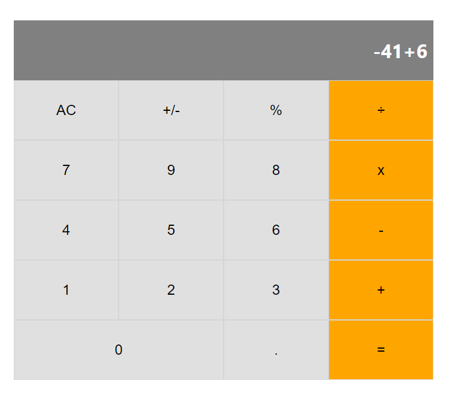

# React Calculator

> A simple calculator implemented in React
- This Project is a serie of Microverse Program, in this milestone we are required to make a React-Calculator with the objective to implement the knowledge we did learn.

## Built With

- Javascript
- HTML
- CSS
- Node.js

## The Add
- Big.js.
- Prop-types.

## Table Of Contents

- [Table Of Contents](#table-of-contents)
- [Built With](#built-with)
- [How to run locally](#how-to-run-locally)
- [Running tests](#running-tests)
- [Live Demo](#live-demo)
- [Authors](#authors)
- [Contributing](#contributing)
- [Show your support](#show-your-support)
- [Acknowledgments](#acknowledgments)
- [License](#license)
  
## How to run locally

- Install Node.js
- Clone this repository by running git clone `https://github.com/dasileker/react-calculator.git`
- Change your current working directory to the project `cd react-calculator`
- Run npm install
- Run npm start
- Enjoy

## Running tests

- Use `npm run test -- --verbose --watchAll=false` to run the unit tests with detailed output.
- Use `npm run test -- --coverage --watchAll=false` to run the unit tests and generate code coverage statistics.
 
## Live Demo 

# Tools 
- React.
- NPM.
- VsCode.
- Linters

## Author

👤 **Zerradi Amine**
 Zerradi Amine
- [Github](https://www.github.com/dasileker)
- [linkedIn](https://www.linkedin.com/in/amine-zerradi)

- Github: [@dasileker](https://github.com/dasileker)

## 🤝 Contributing

Contributions, issues and feature requests are welcome!

Feel free to check the [issues page](issues/).

## Show your support

Give a ⭐️ if you like this project!

## Acknowledgments

- Microverse

## License

This project is [MIT](LICENSE) licensed.